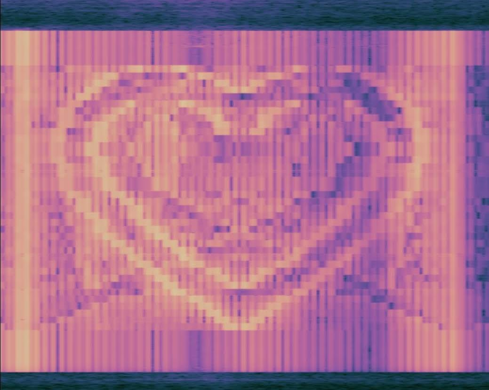

# Waterfall

## Tiny experiment: converting an image into audio to be rendered on an spectrogram waterfall
-------

# Examples

-------

-------

-------

#### [Video](https://photos.app.goo.gl/2zgfC6drr9BkNQFr8)

# Set it up yourself

**Tip:** Simpler images with more black pixels than white work the best for this program

1. Download a spectrogram app with waterfall capabilities (on Android I recommend [Spectroid](https://play.google.com/store/apps/details?id=org.intoorbit.spectrum&hl=en_US))
    - Some settings to start: 
        - Audio: 96kHz sampling, 2048 bins, 10ms transform interval
        - Display: **Linear axis**, 2/3 screen waterfall
2. Visit https://braeden.xyz/waterfall
3. Upload your own image or use the default one
4. Tap on the image with the spectrogram open!

You should see something roughly displaying the image as the audio plays! You can play it on the same device or a different one, and the output should be accurate!

**Note:** You'll notice there's probably a lot of noise and frequency resonance as well.

# Details

- We take an arbitrary image uploaded to a 50x50px canvas
- Like a CRT, we do row by row scans (from bottom -> top)
- Each pixel in a given row is converted to grayscale and becomes a sine wave web audio oscillator:
    - The X pixel location is mapped to a customizable frequency range (where every X value is evenly distributed amoung that range)
        - This frequency becomes the oscillator's pitch frequency
    - The 8 bit grayscale value is converted to a GainNode with a scaled gain based on the lightness of the pixel
        - The oscillator is connected to the GainNode, which in turn is connected to the audio destination
    - The entire row's collection of oscillators is set to start and stop based on a customizable time length
        - After one row is complete, the next row begins playing for the entire image 

We go row by row in the image coverting pixels to the frequency domain -> this collection of sine waves is played as audio -> a spectrogram uses an FFT to capture the values of every frequency -> the spectrogram uses a waterfall to map these changing frequencies over the time domain -> Our image is roughly recreated in the audio waterfall

------

There's almost certainly much better ways to do this, but I thought it was pretty neat, and I tried to do it without looking at external resources -- here's a good example http://www.bastwood.com/?page_id=10!